# Base Placement Plugin - Functional Workflow Diagram

## Complete Flow: From "Load Reachability File" to "Find Base"

```mermaid
sequenceDiagram
    actor User
    participant UI as BasePlacementWidget<br/>(Qt UI)
    participant Widget as BasePlacementWidget<br/>(Logic)
    participant Utils as utils::loadFromHDF5<br/>(data_generation)
    participant AddWayPoint as AddWayPoint<br/>(RViz Panel)
    participant PlaceBase as PlaceBase<br/>(Algorithm)
    participant AddRobotBase as AddRobotBase<br/>(Interactive Markers)

    rect rgb(230, 240, 255)
        Note over User,Utils: PHASE 1: Load Reachability Map
        User->>UI: Click "Load Reachability File"
        UI->>Widget: btn_LoadReachabilityFile::clicked()
        Widget->>Widget: loadReachabilityFile()
        Widget->>Widget: QFileDialog::getOpenFileName()
        Widget-->>User: Select .h5 file

        Widget->>Utils: loadFromHDF5(filename, group_id=0)
        Note right of Utils: Opens HDF5 file<br/>Reads /group/0/reachability_map<br/>Extracts attributes:<br/>- resolution<br/>- origin<br/>- grid sizes
        Utils->>Utils: Convert 3D array to<br/>map<QuantizedPoint3D, double>
        Utils-->>Widget: reachability_map, resolution, origin, sizes

        Widget->>Widget: Convert to legacy format:<br/>QuantizedPoint3D → world coords<br/>Create sphere_col map
        Widget->>AddWayPoint: Q_EMIT reachabilityData_signal(<br/>pose_col_filter,<br/>sphere_col,<br/>resolution)
        AddWayPoint->>PlaceBase: setReachabilityData()
        PlaceBase->>PlaceBase: Store reachability data<br/>for later use
        Note over PlaceBase: Data stored in:<br/>- PoseColFilter<br/>- SphereCol<br/>- res
    end

    rect rgb(240, 255, 240)
        Note over User,AddRobotBase: PHASE 2: Define Waypoints (Optional - Multiple Methods)

        par Interactive Method
            User->>AddWayPoint: Move interactive marker
            AddWayPoint->>AddWayPoint: processFeedback()
            AddWayPoint->>AddWayPoint: Store in waypoints_pos_[]
            AddWayPoint->>Widget: addPointRViz(transform, count)
            Widget->>Widget: insertRow() - Update TreeView
        and Manual Method
            User->>UI: Enter X,Y,Z,Rx,Ry,Rz
            UI->>Widget: btnAddPoint::clicked()
            Widget->>Widget: pointAddUI()
            Widget->>AddWayPoint: Q_EMIT addPoint(tf2::Transform)
            AddWayPoint->>AddWayPoint: addPointFromUI()
            AddWayPoint->>AddWayPoint: Store in waypoints_pos_[]
            AddWayPoint->>AddWayPoint: makeArrow() - Create marker
        and Load from File
            User->>UI: Click "Load Path"
            Widget->>Widget: loadPointsFromFile()
            Widget->>Widget: Parse YAML file
            loop For each waypoint
                Widget->>AddWayPoint: Q_EMIT addPoint(transform)
                AddWayPoint->>AddWayPoint: Store in waypoints_pos_[]
            end
        end
    end

    rect rgb(255, 245, 230)
        Note over User,AddRobotBase: PHASE 3: Select Planning Method
        User->>UI: Select Method from combo_planGroup
        UI->>Widget: selectedMethod(index)
        Widget->>AddWayPoint: Q_EMIT SendSelectedMethod(index)
        AddWayPoint->>PlaceBase: getSelectedMethod(index)
        PlaceBase->>PlaceBase: selected_method_ = index

        alt Method 4: User Intuition
            Widget->>Widget: Check if group_name_ and node_ exist
            Widget->>AddRobotBase: new AddRobotBase(node_, nullptr, group_name_)
            AddRobotBase->>AddRobotBase: init()<br/>Create interactive marker server
            Widget->>AddRobotBase: connect(parseWayPointBtn_signal, parseWayPoints)
            Widget->>AddRobotBase: connect(clearAllPoints_signal, clearAllPointsRviz)
            AddRobotBase->>Widget: connect(baseWayPoints_signal, getWaypoints)
            Note over AddRobotBase: Ready for interactive<br/>base placement
        else Other Methods (0-3)
            Note over PlaceBase: Automatic methods<br/>will be used
        end
    end

    rect rgb(255, 240, 240)
        Note over User,PlaceBase: PHASE 4: Configure Parameters
        User->>UI: Set "Base Location Size"
        User->>UI: Set "High Score Spheres"
        Note over UI: These are stored in<br/>lnEdit_BaseLocSize<br/>lnEdit_SpSize
    end

    rect rgb(240, 230, 255)
        Note over User,PlaceBase: PHASE 5: Execute "Find Base"
        User->>UI: Click "Find Base" (targetPoint button)

        UI->>Widget: targetPoint::clicked() [1]
        Widget->>Widget: sendBasePlacementParamsFromUI()
        Widget->>AddWayPoint: Q_EMIT basePlacementParamsFromUI_signal(<br/>base_loc_size, high_score_sp)
        AddWayPoint->>PlaceBase: setBasePlaceParams(base_loc_size, high_score_sp)
        PlaceBase->>PlaceBase: Store parameters

        UI->>Widget: targetPoint::clicked() [2]
        Widget->>Widget: parseWayPointBtn_slot()
        Widget->>AddWayPoint: Q_EMIT parseWayPointBtn_signal()

        alt Method 4: User Intuition
            AddWayPoint->>AddRobotBase: parseWayPoints()
            AddRobotBase->>AddRobotBase: getWaypoints(waypoints_pos_)
            AddRobotBase->>Widget: Q_EMIT baseWayPoints_signal(base_poses)
            Widget->>Widget: getWaypoints(base_poses)
            Widget->>AddWayPoint: Q_EMIT SendBasePoses(base_poses)
            AddWayPoint->>PlaceBase: getBasePoses(base_poses)
            PlaceBase->>PlaceBase: Store in final_base_poses_user
        else Other Methods
            AddWayPoint->>AddWayPoint: parseWayPoints()
            AddWayPoint->>AddWayPoint: Convert waypoints_pos_ to poses
            AddWayPoint->>PlaceBase: Q_EMIT wayPoints_signal(waypoints)
            PlaceBase->>PlaceBase: BasePlacementHandler(waypoints)
        end

        PlaceBase->>PlaceBase: QtConcurrent::run(findbase, waypoints)
        Note over PlaceBase: Async execution starts
        PlaceBase->>Widget: Q_EMIT basePlacementProcessStarted()
        Widget->>UI: PlaceBaseStartedHandler()<br/>Disable UI

        PlaceBase->>PlaceBase: BasePlaceMethodHandler()

        alt Method 0: PCA
            PlaceBase->>PlaceBase: findBaseByPCA()
            Note right of PlaceBase: Compute PCA<br/>on waypoints<br/>Find optimal orientation
        else Method 1: Grasp Reachability
            PlaceBase->>PlaceBase: findBaseByGraspReachabilityScore()
            Note right of PlaceBase: Use reachability map<br/>Score base positions<br/>by coverage
        else Method 2: IK Solution
            PlaceBase->>PlaceBase: findBaseByIKSolutionScore()
            Note right of PlaceBase: Query IK solver<br/>Count valid solutions<br/>per base position
        else Method 3: Vertical Robot
            PlaceBase->>PlaceBase: findBaseByVerticalRobotModel()
            Note right of PlaceBase: Assume vertical<br/>robot model<br/>Simplified placement
        else Method 4: User Intuition
            PlaceBase->>PlaceBase: findBaseByUserIntuition()
            Note right of PlaceBase: Use base poses from<br/>final_base_poses_user<br/>(from interactive markers)
        end

        PlaceBase->>PlaceBase: Calculate final score
        PlaceBase->>Widget: Q_EMIT basePlacementProcessFinished()
        Widget->>UI: PlaceBaseFinishedHandler()<br/>Enable UI
        PlaceBase->>Widget: Q_EMIT basePlacementProcessCompleted(score)
        Widget->>UI: PlaceBaseCompleted_slot(score)
        UI->>UI: Display "COMPLETED. Score: X"
        UI-->>User: Show result
    end
```



## Component Descriptions

### 1. **BasePlacementWidget** (Qt UI + Logic)
- **Location**: `src/widgets/base_placement_widget.cpp`
- **Role**: Main Qt widget managing UI interactions and data flow
- **Key Signals**:
  - `reachabilityData_signal()`: Emits loaded HDF5 data
  - `parseWayPointBtn_signal()`: Triggers waypoint parsing
  - `basePlacementParamsFromUI_signal()`: Sends algorithm parameters
  - `SendBasePoses()`: Forwards base poses from AddRobotBase
  - `clearAllPoints_signal()`: Clears all waypoints

### 2. **AddWayPoint** (RViz Panel)
- **Location**: `src/add_way_point.cpp`
- **Role**: RViz2 panel managing interactive markers and waypoints
- **Key Data**:
  - `waypoints_pos_` (vector<tf2::Transform>): Stores all waypoints
  - `server_` (InteractiveMarkerServer): Handles 3D markers
- **Key Slots**:
  - `parseWayPoints()`: Converts waypoints to poses
  - `addPointFromUI()`: Adds waypoint from UI
  - `pointDeleted()`: Removes waypoint

### 3. **PlaceBase** (Algorithm Core)
- **Location**: `src/place_base.cpp`
- **Role**: Executes base placement optimization algorithms
- **Key Data**:
  - `PoseColFilter`: Reachability map poses
  - `SphereCol`: Sphere reachability scores
  - `final_base_poses_user`: User-defined base poses (Method 4)
  - `selected_method_`: Current planning method (0-4)
- **Key Methods**:
  - `findbase()`: Main async entry point
  - `BasePlaceMethodHandler()`: Routes to specific method
  - `findBaseByXXX()`: Individual algorithm implementations

### 4. **AddRobotBase** (Interactive Base Placement)
- **Location**: `src/add_robot_base.cpp`
- **Role**: Manages interactive markers for Method 4 (User Intuition)
- **Key Data**:
  - `waypoints_pos_` (vector<tf2::Transform>): Base poses
- **Key Signals**:
  - `baseWayPoints_signal()`: Emits collected base poses

### 5. **utils (Data Generation)**
- **Location**: `data_generation/src/utils.cpp`
- **Role**: Loads/saves HDF5 reachability maps
- **Key Function**:
  - `loadFromHDF5()`: Reads HDF5 file, extracts data, converts to map

## Data Flow Summary

```
HDF5 File (.h5)
    ↓ [loadFromHDF5]
map<QuantizedPoint3D, double>
    ↓ [Convert to world coords]
multimap<vector<double>, double> (sphere_col)
    ↓ [reachabilityData_signal]
PlaceBase::PoseColFilter, SphereCol
    ↓ [Used in findBaseByXXX methods]
Optimal Base Pose + Score
    ↓ [basePlacementProcessCompleted]
UI Display
```

## Key Qt Signal/Slot Connections

| Signal | Emitter | Slot | Receiver |
|--------|---------|------|----------|
| `btn_LoadReachabilityFile::clicked` | UI | `loadReachabilityFile()` | Widget |
| `reachabilityData_signal()` | Widget | `setReachabilityData()` | PlaceBase |
| `targetPoint::clicked` | UI | `sendBasePlacementParamsFromUI()` | Widget |
| `targetPoint::clicked` | UI | `parseWayPointBtn_slot()` | Widget |
| `parseWayPointBtn_signal()` | Widget | `parseWayPoints()` | AddWayPoint |
| `parseWayPointBtn_signal()` | Widget | `parseWayPoints()` | AddRobotBase (Method 4) |
| `wayPoints_signal()` | AddWayPoint | `BasePlacementHandler()` | PlaceBase |
| `baseWayPoints_signal()` | AddRobotBase | `getWaypoints()` | Widget |
| `SendBasePoses()` | Widget | `getBasePoses()` | PlaceBase |
| `basePlacementProcessStarted()` | PlaceBase | `PlaceBaseStartedHandler()` | Widget |
| `basePlacementProcessCompleted()` | PlaceBase | `PlaceBaseCompleted_slot()` | Widget |

## Method Selection Impact

| Method | Name | Uses Reachability Map | Interactive Markers | Algorithm |
|--------|------|----------------------|-------------------|-----------|
| 0 | PCA | ❌ No | ❌ No | Principal Component Analysis |
| 1 | Grasp Reachability | ✅ Yes | ❌ No | Reachability score optimization |
| 2 | IK Solution | ❌ No | ❌ No | IK query count optimization |
| 3 | Vertical Robot | ❌ No | ❌ No | Simplified vertical model |
| 4 | User Intuition | ❌ No | ✅ Yes | Manual interactive placement |

## File I/O Operations

### Input Files
1. **HDF5 Reachability Maps** (`.h5`)
   - Format: `/group/0/reachability_map`
   - Contains: 3D array + attributes
   - Loaded by: `utils::loadFromHDF5()`

2. **YAML Waypoint Files** (`.yaml`)
   - Format: List of `{name, point[x,y,z,rx,ry,rz]}`
   - Loaded by: `BasePlacementWidget::loadPointsFromFile()`

### Output Files
1. **YAML Waypoint Files** (`.yaml`)
   - Saved by: `AddWayPoint::saveWayPointsToFile()`
   - Contains: All current waypoints

## Error Handling

| Error | Location | Handling |
|-------|----------|----------|
| HDF5 load failure | `utils::loadFromHDF5()` | Returns false, logs error |
| File not found | `BasePlacementWidget::loadReachabilityFile()` | QMessageBox::critical() |
| No ROS2 node | `BasePlacementWidget::selectedMethod()` | RCLCPP_ERROR, skip AddRobotBase creation |
| Empty waypoints | `PlaceBase::findbase()` | Check size before processing |

## Performance Notes

- **Async execution**: `findbase()` runs in QtConcurrent thread
- **UI responsiveness**: UI disabled during computation
- **Memory optimization**: Only non-zero reachability values stored
- **File size**: HDF5 files can be large (depends on resolution)

---

**Generated for**: base_placement_plugin
**ROS 2 Version**: Humble
**Date**: 2025
