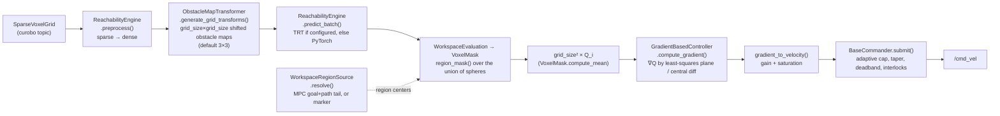
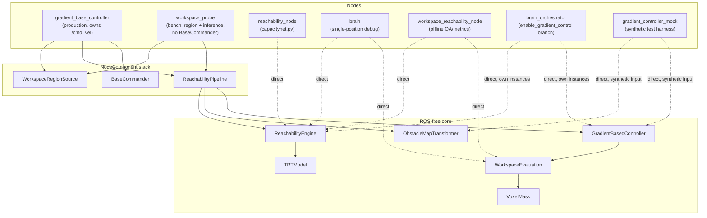
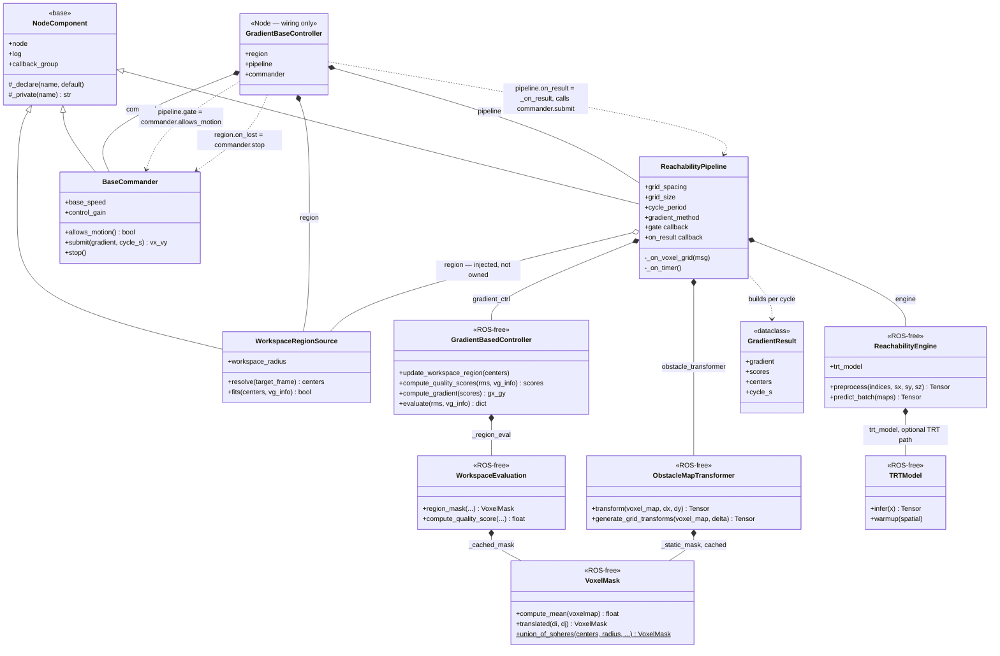

# Architecture — capacitynet

This document describes how the reachability-prediction and base-positioning code
in `capacitynet/` fits together: the per-cycle data flow, which nodes instantiate
which classes, and the class relationships underneath `reachability_pipeline.py`.

There are two integration styles in this package, and knowing which one a file
uses is the fastest way to understand it:

- **The componentized stack** (`WorkspaceRegionSource` + `ReachabilityPipeline` +
  `BaseCommander`, all `NodeComponent`s) — used by `gradient_base_controller.py`
  (production) and `workspace_probe.py` (bench, no `BaseCommander` so it cannot
  move the base). New nodes that need live gradient control should use this.
- **Direct use of the ROS-free core classes** (`ReachabilityEngine`,
  `WorkspaceEvaluation`, `GradientBasedController`, ...) — used ad hoc by
  `reachability_node`, `brain`, `workspace_reachability_node` and the legacy
  `enable_gradient_control` branch of `brain_orchestrator`, each of which builds
  its own instances rather than sharing the componentized stack.

## Per-cycle data flow

What happens every `cycle_period` seconds (default 2.0s), on the latest cached
voxel grid, in the componentized stack (`ReachabilityPipeline._on_timer`). The
voxel grid subscription (`_on_voxel_grid`) only caches the newest message; a
timer drives the actual cycle, decoupling the inference rate from whatever
rate the voxel grid happens to publish at:

The region source and the inference chain run in different callback groups
(`control_group` vs `cuda_group`) so a ~440 ms inference cycle cannot stall
`/cmd_vel` publishing — see `gradient_base_controller.py`.

## Nodes → components

Which console-script node instantiates which class. Solid arrows are the
componentized stack; dashed arrows are a node building its own instance of a
ROS-free core class directly.

`grasp.py`, `metrics_recorder.py`, `plot_metrics.py` and `replay_maps.py` touch
none of these classes and are omitted.

## Classes around ReachabilityPipeline

`ReachabilityPipeline` and `BaseCommander` never import each other — the
coupling above (`gate`, `on_result`, `on_lost`) is assigned by
`GradientBaseController` after construction, so a node that omits
`BaseCommander` (`workspace_probe`) gets a pipeline that runs identically but
has nothing wired to `gate` and no way to reach `/cmd_vel`.

## Related docs

- `TESTING.md` — running the gradient controller against synthetic or bag data.
- `OPTIMIZATIONS.md` — TensorRT export, CUDA Graph capture, batching constraints.
